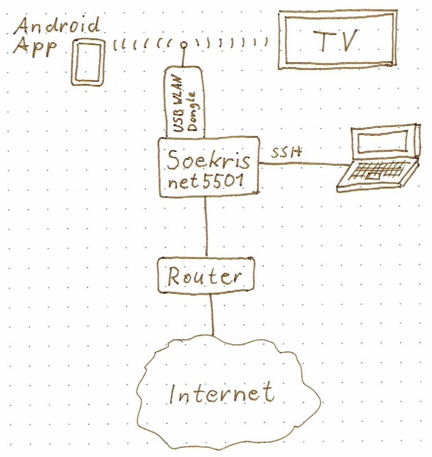

---
@title[Title]

@size[2.7em](Remote-Controlling a Smart TV with HTTP)

Alexander Stedile, Bernhard (Slash) Trummer

Presented at Grazer Linuxtage 2019

---

## Abstract

Remote-Controlling a Smart TV with HTTP

A pure programming project, no device needs to be built.
A little bit of network engineering for research.

---

## Presentation Overview

- Motivation
- Aim
- Research
- API, Protocol
- Application lgremote
- Lessons Learned

---

## Motivation

The TV has so many ways to interact with it. 

How can I get access to it for building my own remote control features?

+++

@snap[north span-100]
### Smart TV Connectivity 
@snapend

@snap[south-west span-60]

LG Smart TV 42LA6608-ZA
  

@ul
* Broadcast: DVB-T/C/S
* Video: HDMI, Scart, Chinch
* USB
* LAN, WLAN
* Remote control: Infrared, Radio (Magic Remote), Android App
@ulend
@snapend

@snap[south-east span-40]

@snapend

---

## Aim

I want to be able to invent and try out new features 
for a smarter remote control. 

It should be easy to add and modify functionality.

---

@snap[north-west span-65]
## Research

Packet Sniffing
@ul
* WLAN network setup
* tcpdump
* Wireshark
@ulend

  
Internet Research

@snapend

@snap[east span-35]

@snapend

+++

### Research Network Setup

+++

### Research Approach

@ul[]
- Initially we just tried to replay requests sent by the official app. But we always got back: 401
- No encryption, no authentication headers (etc.) in requests. WTF?
- Theory: TV does some MAC or IP whitelisting.
- Reset official app and repeat sniffing of the communication from the very beginning.
- There's a simple "pairing" process. After replaying it, all kinds of "real" requests work.
@ulend

+++

### Fun Fact

@ul[]
- When the official app queries the EPG: GET [/roap/api/data?target=SearchQRYEpgInfo]() HTTP/1.1
- ... the TV responds with a: HTTP/1.1 500 Internal Server Error
@ulend

+++

### Not-so-fun Facts

@ul[]
- "red button" is e.g. loaded from http://hbbtv.prosiebensat1puls4.com
- ... with a lot of (tracking?) cookies in the request
- The "red button" content is effectively just JavaScript executed in the TV's browser
- ... including external tracking (http://cdn.wbtrk.net/js/geid.min.js)
- All communication is plain text HTTP!
- Injection of arbitrary JavaScript via MITM attacks &#8594; easy
@ulend

---

## ROAP - API, Protocol

* HTTP, GET and POST
* XML payload, Media Type: application/atom+xml

+++

## ROAP - API, Protocol Phases

RC Client &#8596; TV
* &#8592; Device discovery &#8213;
* &#8213; Authentication &#8594;
* &#8213; Data request &#8594;
* &#8213; Command &#8594;
* &#8592; Event &#8594;

---

## Application lgremote

+++

### Scope

* Replacement for remote control
* Automating repeated actions
* Dynamic favourite channel list

+++

### Out of Scope
* Device discovery phase
* Digital video recorder
* Teletext
* Magic Remote pointer

+++

### Tab 1: Connect

1. Request auth key ... TV shows secret six digit key
1. Connect ... Client is paired until Disconnect or TV is turned off

+++

### Tab 2: Virt RC

1. Current channel is displayed with name
1. off ... turn off TV
1. @color[red](A) ... Favourite channel list A is not selected
1. Press documented keys to send commands to TV

+++

### Tab 3: Feature

1. Fade out/in ... lower/raise volume (with limit)
1. Channels down/up ... walk through channel list (with skipping)
1. Swap ... exchange current and stored channel

+++

### Tab 4: Skip CH

1. Channels will be omitted when walking up/down
1. add/remove/clear ... choose channels to skip
1. invert ... swap chosen and non-chosen channels 

+++

### Ideas for Further Features

@ul[]
- On/off toggle for skipping channels
- Look if commercials are finished
- Repeatedly query current program info
@ulend 

---

## Lessons Learned

@ul[]
- Current volume level cannot be queried.
- Uplink to Internet is required for TV to accept network connection.
- Turning off TV takes 15 seconds if "byebye" event cannot be sent to connected client.
- For selecting a channel, 4 parameters have to be sent. (Can be queried with channel list.)
- The smart TV sends lots of requests to the Internet. Also to the TV stations for retrieving additional contents.
@ulend

---

## References

* lgremote project  
https://github.com/astedile/lgremote
* LG TV Remote Android App - 
https://play.google.com/store/apps/details?id=com.lge.tv.remoteapps
* LG TV 2012 mit deviceinfo steuern, funktioniert in Neo - 
https://homematic-forum.de/forum/viewtopic.php?t=29820

---

## Summary

---

## Feedback

is very welcome. Talk to me today 
or use the feedback feature on www.linuxtage.at
