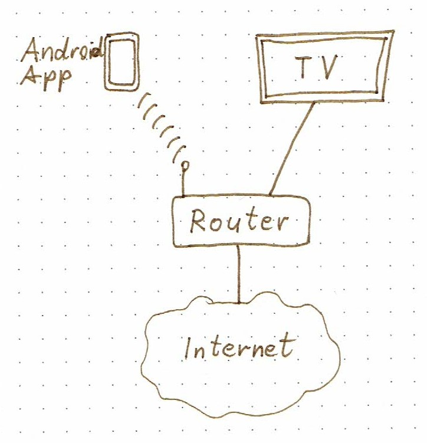
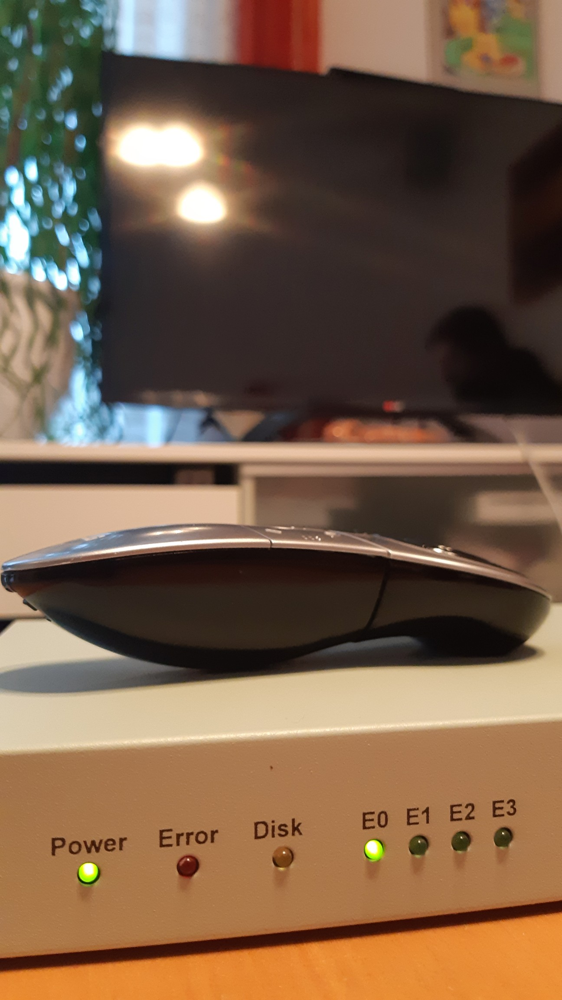
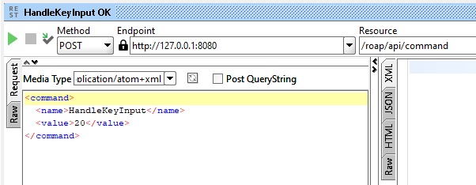
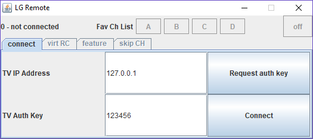
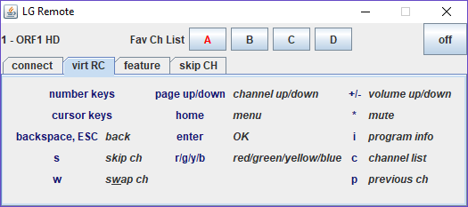
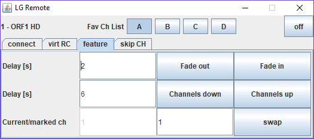
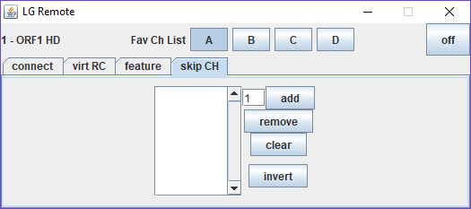

---
@title[Title]

@size[2.7em](Remote-Controlling a Smart TV with HTTP)

Alexander Stedile, Bernhard (Slash) Trummer

Presented at Grazer Linuxtage 2019

---

## Abstract

Remote-Controlling a Smart TV with HTTP

A pure programming project, no device needs to be built.
A little bit of network engineering for research.

---

## Presentation Overview

- Motivation
- Aim
- Research
- API, Protocol
- Application lgremote
- Lessons Learned

---

## Motivation

The TV has so many ways to interact with it. 

How can I get access to it for building my own remote control features?

+++

@snap[north span-100]
### Smart TV Connectivity 
@snapend

@snap[south-west span-60]

LG Smart TV 42LA6608-ZA

@ul
* Broadcast: DVB-T/C/S
* Video: HDMI, Scart, Chinch
* USB
* LAN, WLAN
* Remote control: Infrared, Radio (Magic Remote), Android App
@ulend
@snapend

@snap[south-east span-40]

@snapend

---

## Aim

I want to be able to invent and try out new features 
for a smarter remote control. 

It should be easy to add and modify functionality.

---

@snap[west span-65]
## Research

Packet Sniffing
@ul
* WLAN network setup
* tcpdump
* Wireshark
@ulend

Internet Research

@snapend

@snap[east span-35]

@snapend

---

## ROAP - API, Protocol

* HTTP (GET and POST)
* XML payload (Media Type: application/atom+xml)

+++

## ROAP - API, Protocol Phases

RC Client &#8596; TV
* &#8592; Device discovery &#8212;
* &#8212; Authentication &#8594;
* &#8212; Data request &#8594;
* &#8212; Command &#8594;
* &#8592; Event &#8594;

---

## Application lgremote

+++

### Scope

* Replacement for remote control
* Automating repeated actions
* Dynamic favourite channel list

+++

### Out of Scope
* Device discovery phase
* Digital video recorder
* Teletext
* Magic Remote pointer

+++

### Tab 1: Connect

+++

### Tab 2: Virt RC

+++

### Tab 3: Feature

+++

### Tab 4: Skip CH

+++

### Ideas for Further Features
* On/off toggle for skipping channels
* Look if commercials are finished
* Repeatedly query current program info

---

## Lessons Learned
* Current volume leven cannot be queried.
* Uplink to Internet is required for TV to accept network connection.
* Turning off TV takes 15 seconds if "byebye" event cannot be sent to connected client.
* For selecting a channel, 4 parameters have to be sent. 
(Can be queried with channel list.)
* The smart TV sends lots of requests to the Internet.
Also to the TV stations for retrieving additional contents.
---

## References

* lgremote project  
https://github.com/astedile/lgremote
* LG TV Remote Adnroid App - 
https://play.google.com/store/apps/details?id=com.lge.tv.remoteapps
* LG TV 2012 mit deviceinfo steuern, funktioniert in Neo - 
https://homematic-forum.de/forum/viewtopic.php?t=29820

---

## Summary

---

## Feedback

is very welcome. Talk to me today 
or use the feedback feature on www.linuxtage.at
